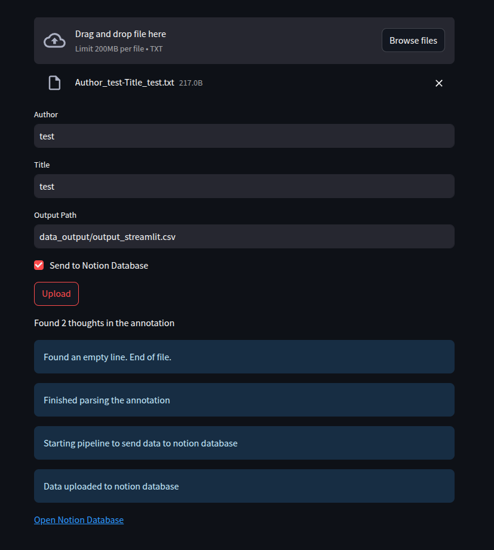

# readwise_onyx_boox
Since Readwise.io and Onyx Boox did not provide integration I decided to write it myself. It allows processing annotation.txt file from Onyx boox to csv file that can be uploaded to readwise.io or if you wish notify you every day with your quote using windows console

## Installation
Install python if you don't have it otherwise. For linux activate and install using sample:
Python 3.7 >

```bash
python3 -m venv .venv
source activate_virtual_env.sh
```

add environement variables in `.env` file

```bash
google_PASS=<YOUR PASS>
notion_API_KEY=<YOUR_KEY>
notion_DATABASE_ID=<DATABASE_ID>
notion_USERNAME=<USERNAME>
```

## expected input
```bash
file.txt
```
which is a file exported from NeoReader application as click on the annotations in the book and export

## expected output
```bash
output.csv
```
which is formated to Readwise.io format ready to be imported thru option "import csv" thru Readwise webstie

## Test
If you want to test general workflow run first
```bash
python main.py --author test --title test --filepath data_input/Author_test-Title_test.txt --output_path output_test.csv --pipeline
```

# How to run
1. Get the input file from your onyx boox Neoreader as .txt file

2. if you wish to generate .csv file to upload to readwise.io webpage

run code below

```bash
python main.py --author author --title title --filepath file.txt --output_path output.csv
```

## Usage with streamlit app

To run the Streamlit application, execute the following command in your terminal:

```
streamlit run src/app.py
```



Once the application is running, you can:

1. Upload a file containing book annotations.
2. Input the required parameters:
   - Author
   - Title
   - Output Path
3. Click the "Upload" button to process the file and extract thoughts.

4. Checkbox if you wish to send it directly to your notion database

5. otherwise `.csv` file is saved in `output path` is formated to be uploaded directly to `Readwise.io`


# How to use it with Readwise.io
Once  you got your output.csv file continue with

6. Go to your readwise.io account and import highlights
7. Select import csv file and select output.csv file
8. Done

# How to send data to the notion database as a single step
You can now send data to the notion database by providing the outputed .csv file. Get your database id and notion key from notion.

provide them in the files in `.env` and run

```
notion_processing.py --filepath output.csv
```

Notion Template to duplicate with the supported schema: https://adamverano.notion.site/119999ea1a1d442c8889ef2bd25db803?v=800f2a9cf95c4480b0e454aaf7db3c00

# How to send email
You can send email to yourself using notify.py file.

You can use .csv database in that case just provide file to a file or write 'notion' to use your notion database that you saved

```python
python -m notification.notify --sender YOUR_EMAIL --receiver  TARGET_EMAIL --database_path notion
```

read your google password from file to provide in send_email.py

--------------------------------------------
## TODO Next
- [x] Storing the highlights in common database
- [x] Initial cleanup after export from Onyx, first line of .txt
- [ ] Setup AWS Lambda funtion that will retrieve random row and send to yourself once a week
- [ ] Setup vector database that will digest the annotations
- [ ] Setup RAG interfaces that allows to search relevant annotations semantically
- [ ] Setup retrieval interface that will show annotations
- [ ] add MCP tool that allow to search similar topic in internet and enrich your annotation
